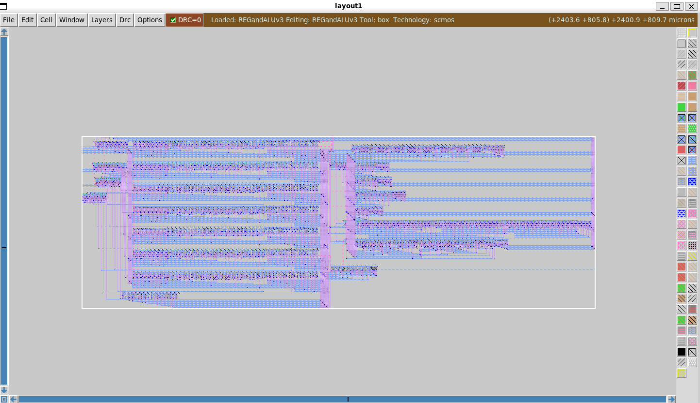
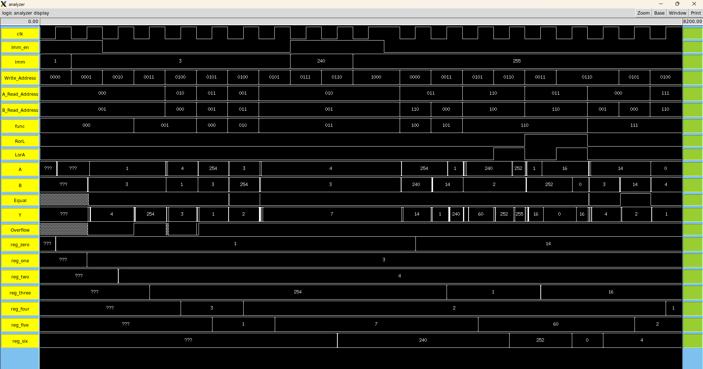

# Full-Custom VLSI 8-bit Integrated Datapath
**Course:** CMPE 480 - VLSI Design  
**Implementation:** Transistor-Level CMOS (Static Logic)

## 📋 Project Overview
This project involves the design, layout, and functional verification of an **8-bit Integrated Datapath**. Unlike standard cell-based designs, this system was built from the ground up using a custom CMOS library. The architecture features a high-performance **8-function ALU** tightly integrated with a **7+1 Register File**, supporting a complete internal write-back loop for multi-cycle arithmetic and logic operations.

## 🛠️ Hardware Architecture

### Register File (7+1 Configuration)
A multi-port storage unit designed for simultaneous dual-read and single-write operations.
* **Organization:** 7 general-purpose 8-bit registers + 1 hardwired **Zero Register** (Register 0).
* **Synchronization:** Optimized for stable write-back, ensuring ALU results are correctly latched without race conditions.

### Multi-Functional ALU
The ALU handles 8 distinct operations driven by a 3-bit function code:
* **Arithmetic:** 8-bit Addition and Subtraction with hardware-level **Overflow Detection**.
* **Barrel Shifter:** Mux-based shifter supporting Logical/Arithmetic shifts and 8-bit rotations.
* **Magnitude Comparison:** 8-bit comparator architecture optimized for $A > B$, $A < B$, and $A = B$ flags.
* **Bitwise Logic:** CMOS-level AND, OR, XOR, and NOR.

### Physical Design (VLSI)
* **Custom Cell Library:** Built using over 100 manually designed CMOS cells, including basic logic gates and sequential **D-Flip Flop (DFF)** arrays.
* **Design Flow:** Transitioned from transistor-level schematics to optimized physical layouts with **DRC=0** clearance.

## 🔍 Architectural Visualization

### Full-Custom Physical Layout
The image below showcases the manual transistor-level layout of the 8-bit Datapath, including the Register File and ALU subunits, optimized for area and signal integrity.

### Functional Timing Analysis
The following logic analyzer trace demonstrates successful instruction execution, register write-backs, and flag synchronization across multiple clock cycles.

## 🧪 Functional Verification
The system was validated using a comprehensive suite of **16+ test vectors** (see `/verification` folder).
* **Test Coverage:** Verified all ALU opcodes, signed/unsigned arithmetic, and shift-logic boundaries.
* **Results:** Achieved a **100% pass rate** for the integrated Write-Back loop and data-path synchronization.

## 📂 Repository Structure
* **/docs**: Contains the Final Technical Report (PDF) and Layout Presentation (PPTX).
* **/verification**: Contains the `Functional_Verification_Suite.csv` with all test vectors.
* **/images**: Architectural diagrams and CMOS layout screenshots.

---
**Design Team:** Nahom Solomon, Connor Prior, Seth Iris Canonigo, Tedla Boke
